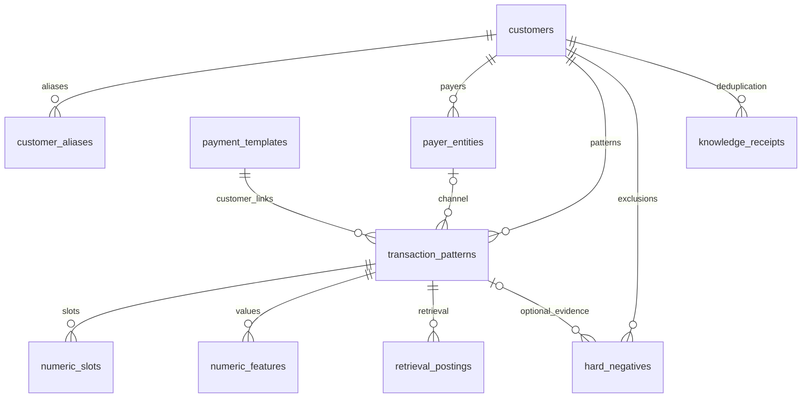

# Cấu trúc kho kiến thức PostgreSQL

Nguồn chuẩn: `app/db.py`; DDL database mới: `sql/create_current.sql` (chỉ chạy một file, không cần migration). PostgreSQL 15+ cần pgvector cài trên máy chủ, extension `vector` và `pg_trgm`. Quản trị viên tự chạy SQL; backend không tự migrate.

## Phạm vi lưu trữ

PostgreSQL chỉ lưu hồ sơ và bằng chứng đã học: khách hàng, bí danh, mẫu nội dung, số, người trả tiền, khóa truy xuất, loại trừ và dấu chống học trùng. Không lưu mọi giao dịch đã lọc, toàn bộ phản hồi hay lịch sử tác vụ.

Mẫu đã học vẫn có `raw_example`, nguồn và ngày ví dụ để giải thích kết quả ghép. Đây là ví dụ đại diện của kiến thức, không phải bảng lịch sử tất cả giao dịch. Hash chống trùng và thông tin import là metadata của quá trình học.

`knowledge_metadata` là bảng key/value độc lập, không có FK.

## Danh mục 12 bảng

| Bảng | Trường chính | Ràng buộc / ý nghĩa |
| --- | --- | --- |
| `customers` | `id VARCHAR(100)`, `canonical_name TEXT`, `normalized_name TEXT` | PK là mã dạng chuỗi; tên chuẩn hiển thị, tên bỏ dấu dùng tìm kiếm. |
| `customer_aliases` | `id`, `customer_id`, `alias`, `normalized_alias`, `confidence` | Unique `(customer_id, normalized_alias)`; tên con người xác nhận có confidence 1.0, tên trích tự động dưới 1.0 và chỉ hỗ trợ retrieval cho đến khi xác nhận. |
| `payer_entities` | `id`, `customer_id`, `payer_name`, `payer_type`, `confidence`, `seen_count`, `last_seen`, `last_period` | Unique `(customer_id, payer_name)`; cùng thẻ/tài khoản có thể thuộc nhiều khách hàng, khi đó không được xem là định danh duy nhất. |
| `payment_templates` | `id`, `fingerprint`, `template_text`, `structure`, `display_name`, `description`, `payment_mode`, `provider_kind`, `provider_name`, `created_at`, `max_transfer_customers`, `settlement_rows` | Bố cục dùng chung, unique fingerprint; một mẫu có nhiều khách hàng, không chứa bộ giá trị số riêng. Loại mặc định do admin xác nhận (hoặc lấy từ kênh thu hộ trong tệp FN); liên kết mới thiếu nhãn riêng dùng loại này. `max_transfer_customers`: số khách hàng lớn nhất trong một lần chuyển; `settlement_rows`: dòng thu hộ tổng hợp học gọn. |
| `customer_id_slots` | `id`, `context` (unique), `hits`, `total`, `example`, `updated_at` | Ngữ cảnh vị trí số học từ dữ liệu xác nhận; dựng lại sau mỗi lần nhập. |
| `transaction_patterns` | `id`, `customer_id`, `template_id`, `payment_mode`, `provider_kind`, `provider_name`, `payer_id`, fingerprint, ví dụ, cấu trúc/số, vector, nguồn/thống kê | Liên kết khách hàng với mẫu chung; unique `(customer_id, fingerprint)` giữ các bộ định danh riêng. `payer_id` nullable liên kết kênh đại diện. |
| `numeric_slots` | `id`, `pattern_id`, `slot_index`, `slot_confidence`, `seen_count`, `last_period` | Unique `(pattern_id, slot_index)`; thống kê độ ổn định vị trí số. |
| `numeric_features` | `id`, `pattern_id`, `slot_index`, `numeric_value TEXT`, `value_digest VARCHAR(64)`, `numeric_type`, `exact_value_confidence`, `seen_count`, `missing_count`, `last_period`, `last_seen` | Unique `(pattern_id, slot_index, value_digest)`; nhiều giá trị theo slot; giữ nguyên văn, không giới hạn 100 ký tự. |
| `retrieval_postings` | `id`, `token TEXT`, `token_digest VARCHAR(64)`, `pattern_id`, `weight` | Unique `(token_digest, pattern_id)`; inverted index nối khóa truy xuất với mẫu. |
| `hard_negatives` | `id`, `transaction_fingerprint`, `customer_id`, `pattern_id` nullable, `count` | Unique `(transaction_fingerprint, customer_id)`; bằng chứng từ chối ghép nội dung với khách hàng này. |
| `knowledge_receipts` | `id`, `fingerprint`, `customer_id`, `period` | Unique `fingerprint`; dấu chống học trùng, khách hàng và kỳ. Có receipt cho học dương và cho hành động loại trừ. |
| `knowledge_metadata` | `key VARCHAR(100)`, `value TEXT` | PK `key`; phiên bản encoder/extractor, file import SHA-256 và trạng thái/kỳ/thống kê học. |

Các FK không tự `ON DELETE CASCADE`. API xóa liên kết theo thứ tự trong một transaction; không nên xóa riêng một hàng cha bằng SQL.

Schema hiện có 12 bảng; kho phiên bản 003 bổ sung bằng `sql/migrations/004_learned_id_slots.sql`. Việc tách mẫu dùng chung cần database mới tạo từ `sql/create_current.sql`, hoặc migration `003_shared_templates.sql` đối với kho knowledge-only cũ. NER học alias và xuất theo sheet không cần thêm bảng riêng. Tên tự động gắn với IDKH đã xác nhận, không tự đổi tên chuẩn. Xem [mẫu chung, proxy/self và SQL](shared-payment-templates.md).

## Một mẫu được lưu thế nào?

Ví dụ đã xác nhận: `TT KH:001234 HD:700012 TIEN NUOC`.

- `customer_id = '001234'`, tên lấy từ hồ sơ khách hàng.
- `raw_example`: toàn bộ câu gốc, không bỏ dấu hay cắt số.
- `template_text`: chữ chuẩn hóa và placeholder số theo thứ tự.
- `structure`: chuỗi vai trò/định dạng số.
- `segments JSONB`: thứ tự đoạn, giá trị đầy đủ, vai trò, slot, định dạng và vị trí gốc.
- `fingerprint`: SHA-256 của `[template, structure, ordered_identity]`. Định danh bao gồm hợp đồng/mã quan trọng với giá trị đầy đủ; cùng chữ nhưng hợp đồng khác có thể thành mẫu khác.
- `embedding vector(384)`: vector semantic text; `embedding_model` ghi tên encoder.
- `source_file`, `source_row`, `example_date`: nguồn ví dụ để hiển thị khi đối chiếu lịch sử.
- `confidence`, `seen_count`, `last_seen`, `last_period`: bằng chứng tái xuất hiện, không phải xác suất đã hiệu chuẩn.

Hai slot có hai hàng `numeric_slots`, và giá trị tương ứng trong `numeric_features`. Mẫu có các posting như `template:<hash>`, `id:`, `n:`, `contract:`, `name:`, `payer:`, `code:`, `detail:`, từ nội dung và bucket vector tùy dữ liệu.

Không có ràng buộc unique HD theo khách hàng: `contract:<value>` có thể trỏ tới nhiều liên kết thuộc nhiều IDKH. Mỗi liên kết giữ giá trị/slot riêng. Một HD có nhiều IDKH không yêu cầu thêm bảng hay đổi schema; ưu tiên IDKH được xử lý trong logic học/đối soát.

Không lưu riêng mọi hóa đơn: số hóa đơn là feature biến đổi khi trích xuất được; mẫu lưu một ví dụ đại diện và các giá trị theo slot đã học.

## Chỉ mục và chuỗi số dài

Giá trị số/token là `TEXT`; SHA-256 cố định 64 ký tự dùng cho B-tree/unique. Tra cứu kiểm tra **digest và toàn bộ giá trị gốc**. Điều này giữ số dài, số 0 đầu và mã chữ/số, đồng thời tránh chỉ mục B-tree trên chuỗi gốc quá dài.

Chỉ mục bổ sung: FK theo khách hàng/mẫu; GIN trigram trên tên chuẩn/bí danh/template; GIN full-text `to_tsvector('simple', template_text)`; HNSW cosine trên vector; hash nội dung hard negative và hash unique receipt.

Default ORM như digest/count/confidence được Python cấp khi ghi. DDL không cung cấp mọi server default: nhập trực tiếp bằng SQL phải cung cấp các cột NOT NULL, tính đúng digest và bảo đảm quan hệ/chỉ mục nghiệp vụ. Nên thêm mẫu qua giao diện hoặc CSV học.

## Quyền quản lý trên web

Xem/tìm kiếm/phân trang/chi tiết **mọi bảng ứng dụng**. Khách hàng được thêm/sửa tên/xóa; liên kết mẫu được thêm biến thể/sửa/xóa. Mẫu chung được đặt tên/ghi chú/gán thu hộ hoặc tự trả; từng liên kết có thể giữ loại riêng. Các bảng kỹ thuật chỉ đọc để không sửa riêng vector/token/confidence làm knowledge mất nhất quán.

- Thêm biến thể: giữ mẫu cũ và học mẫu mới cho cùng khách hàng.
- Sửa mẫu: phân tích lại số, tính embedding, xây postings; thay mẫu sai hoặc gộp vào mẫu tương thích đã có.
- Xóa mẫu: xóa slots/features/postings; hard negative giữ khách hàng bị từ chối và bỏ liên kết tới mẫu đã xóa. Payer không còn dùng được dọn.
- Xóa khách hàng: xóa knowledge liên quan, bao gồm receipt và negative của khách hàng.
- File kết quả cũ giữ snapshot, không đổi theo quản lý knowledge. Khi xác nhận phải chọn hồ sơ hiện có hoặc đăng ký lại nếu khách hàng đã xóa.

Sửa/xóa knowledge bị chặn khi có tác vụ đang chạy hoặc xác nhận chờ hoàn tất. API ghi dùng advisory lock phối hợp import/xác nhận.

Nguồn: [schema SQL hiện tại](../sql/create_current.sql), [ORM](../app/db.py), [quy trình tìm và học](matching-and-learning.md).
