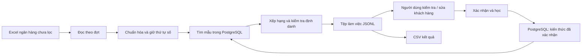
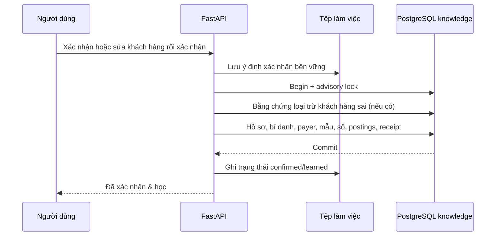

# Cơ chế tìm kiếm, so khớp và học kiến thức

Tài liệu mô tả implementation trong `app/normalize.py`, `app/numeric_match.py`, `app/core.py`, `app/knowledge.py`, `app/main.py` và `app/workspace.py`. Các tệp thử nghiệm theo tháng không quyết định cách vận hành của giao diện.

## 1. Hai luồng tách nhau



Phân loại gọi `Core.classify()` và không thêm kết quả dự đoán vào PostgreSQL. Mỗi đợt đối soát đọc knowledge trong transaction `REPEATABLE READ READ ONLY` trên PostgreSQL. Phần đã phân loại được ghi vào tệp làm việc ngoài database.

Luồng triển khai quét mọi sheet trong XLSX, nhận diện cột theo tiêu đề riêng từng sheet và giữ `sheet/payer/reference` trên kết quả/CSV. Import đọc các sheet đã có nhãn; CSV học đọc mọi dòng/kênh. Các trường ngày/số tiền/chiều giao dịch chưa đáng tin trả manual 0% trước khi gọi bộ so khớp. Sheet không phải bố cục giao dịch được liệt kê trong tác vụ, không bị giả lập thành giao dịch. Giới hạn BIDV của benchmark theo tháng chỉ thuộc công cụ phát triển.

Xác nhận gọi `Core.review()` rồi `Core.learn()` trong transaction ghi có advisory lock. Thay đổi chỉ xuất hiện trong kho kiến thức sau khi transaction commit. Xác nhận trong lúc đối soát có thể ảnh hưởng đến các đợt đọc kiến thức **sau đó**; các kết quả đã tạo không được thay đổi ngầm.

## 2. Chuẩn hóa vẫn bảo toàn số

Đầu vào được lưu nguyên văn ở `raw_example` đối với mẫu đã học hoặc `raw` trong tệp làm việc đối với dòng chưa duyệt.

Để tìm kiếm, hệ thống tạo thêm:

- `normalized`: chữ thường, bỏ dấu để đối chiếu từ ngữ; giá trị số vẫn là chuỗi.
- `segments`: các đoạn text/number/date theo thứ tự, với vị trí và offset gốc.
- `template`: nội dung chữ và placeholder `<NUM_1>`, `<NUM_2>`…; mã chữ/số giữ hình dạng chữ và vị trí số.
- `structure`: chuỗi vai trò/định dạng theo thứ tự.
- `semantic_text`: tiếng Việt giữ dấu; ngày và giá trị định danh được thay bằng vai trò trước khi đưa vào encoder.

Ví dụ:

```text
TT KH:001234 HD:700012 TIEN NUOC
```

```json
{
  "template": "tt kh <NUM_1> hd <NUM_2> tien nuoc",
  "numbers": [
    {"slot": 1, "numeric_type": "CUSTOMER_ID", "value": "001234"},
    {"slot": 2, "numeric_type": "CONTRACT_ID", "value": "700012"}
  ]
}
```

Giá trị số không được đổi sang float/int, không cắt chuỗi, không tự chia một chuỗi số dài thành các mã khách hàng. `raw_value` trong segments giữ cách ghi gốc. Các token chữ/số liền nhau được giữ nguyên; hợp đồng có dấu nối hoặc dấu `/` được bảo vệ khỏi việc tách sai.

### Vai trò của số

| Vai trò | Cách dùng |
| --- | --- |
| CUSTOMER_ID | Định danh khách hàng có ngữ cảnh rõ ràng. |
| CONTRACT_ID | HD/hợp đồng; một HD có thể liên kết nhiều IDKH. Khi có IDKH rõ ràng đã biết, ưu tiên IDKH; không có IDKH thì HD chỉ là bằng chứng định danh mạnh khi khớp chính xác và duy nhất. |
| CARD_ID / ACCOUNT_ID | Thẻ hoặc tài khoản người trả tiền; kiểm tra có dùng chung cho nhiều khách hàng không. |
| MIXED_CODE / LOCATION_NUMBER | Mã chữ/số, số cơ sở; khác giá trị ở đúng vai trò có thể chặn ghép. |
| INVOICE_ID / INVOICE_CODE | Thông tin hóa đơn; có thể thay đổi theo khoản thu, không tự xác lập khách hàng. |
| BANK_REFERENCE / BANK_PROTOCOL / REFERENCE_ID | Tham chiếu/giao thức thay đổi; không tự dùng làm định danh. |
| RECEIVER_ACCOUNT | Tài khoản nhận tiền của đơn vị cấp nước; không dùng làm tài khoản khách hàng trả tiền. |
| DATE / AMOUNT / QUANTITY | Không tự xác định khách hàng. |
| UNKNOWN_NUMBER | Chưa đủ ngữ cảnh; chỉ dùng làm chứng cứ khách hàng khi đã có xác nhận gắn đúng token/vị trí. |

`HD` luôn là **hợp đồng**, không phải hóa đơn. Chỉ ngữ cảnh `hóa đơn/invoice` mới là số hóa đơn. `TKThe` là thẻ của người trả tiền, không phải mã khách hàng.

Nhãn mã khách hàng nhận các cách ghi `Ma KH-279021`, `Mã KH:279021`, `Mã khách hàng`, `Mã số KH`, `MaKH279021`, `IDKH`, `ID KH`, `MKH`, `KH`, `Customer ID/Code/Number`, có hoặc không dấu, hoa/thường và dấu phân cách. Danh sách có nhãn như `KH:001234,005678`, `IDKH:001234 và 005678` hoặc lặp lại `KH:001234 KH:005678` giữ từng giá trị đầy đủ theo thứ tự. Không chia một chuỗi số liền thành nhiều mã dựa vào độ dài.

Ví dụ `TTHD Tien nuoc Ma KH-279021 Ma HD-Ky 8/2026` có mã khách hàng **279021**; `Ky 8/2026` là kỳ, không phải giá trị hợp đồng. Kỳ và ngày tiếp tục được bỏ khỏi đặc trưng học, chỉ đọc riêng để hiển thị ở đối soát.

Có một ngoại lệ rõ ràng ở **tra cứu hồ sơ mã khách hàng**: `id_key()` bỏ số 0 đầu để tìm các biến thể mã được xác nhận là cùng hồ sơ, ví dụ `001234` và `1234`. Cơ chế này không áp dụng cho hợp đồng, thẻ, tài khoản hoặc giá trị lưu trong numeric features. Giá trị đầy đủ và mẫu theo từng cách ghi vẫn được giữ và ưu tiên so khớp nguyên văn. Nếu khóa này ánh xạ tới nhiều hồ sơ, đối soát trả manual 0%; học một mã biến thể mới cũng không tự chọn hồ sơ đầu tiên để gộp.

### Quan hệ HD và IDKH

Học không áp ràng buộc một HD chỉ thuộc một khách hàng. Ví dụ `KH:001234 HD:700012` và `KH:005678 HD:700012` có thể được học sau xác nhận; các số lưu trên liên kết riêng.

### Một giao dịch thanh toán cho nhiều khách hàng

Nội dung có nhiều IDKH được phép học. Mỗi dòng học xác nhận một IDKH. Muốn học cho hai khách hàng, nhập hai dòng có cùng `NOIDUNG` nhưng `IDKH` và `TENKH` tương ứng, hoặc thêm từng liên kết qua **Quản lý kiến thức → Thêm mẫu**. Không gộp danh sách vào một mã khách hàng mới và không tự xác nhận các mã còn lại chỉ vì chúng xuất hiện trong nội dung.

Mỗi khách hàng có một `transaction_patterns` riêng liên kết tới mẫu giao dịch; `segments` và `numeric_features` giữ toàn bộ các số và thứ tự của giao dịch nhiều khách hàng. Posting `id:` chỉ dùng IDKH của hồ sơ được xác nhận, không gán các IDKH khác trong nội dung cho hồ sơ đó. Receipt chống trùng cũng riêng theo khách hàng. Tên trích tự động không được dùng làm bí danh trong giao dịch nhiều khách hàng; chỉ tên người dùng xác nhận cho từng IDKH được học.

Giao dịch có nhiều IDKH vẫn là kiểm tra thủ công 0%, kèm **đề xuất phân bổ** `allocation_customer_ids` (mã đã có trong kho) và `unknown_allocation_ids`. Người duyệt xác nhận một lần bằng các mã cách nhau dấu phẩy; mỗi mã được học thành một liên kết riêng. Không tự chọn một mã hay chia số tiền. Nếu đổi xác nhận từ A sang B khi cả A và B đều có trong giao dịch, không tạo bằng chứng loại trừ A.

Trong đối soát, IDKH rõ ràng được tra trên toàn kho trước; chưa biết hoặc ánh xạ nhiều hồ sơ vẫn manual 0%, không chuyển sang chọn theo HD. IDKH đã biết duy nhất giới hạn ứng viên và được ưu tiên trước HD, kể cả khi HD chưa liên kết tới khách hàng đó hoặc khác ví dụ đại diện. Không học quan hệ mới trong lúc đối soát. Khi không có IDKH, HD dùng chung không được coi là bằng chứng duy nhất; các chủ sở hữu hợp đồng và các mã khác vẫn được kiểm tra. `customer_id_priority_over_contract`, `shared_contract_customer_ids`, `consistent_new_contracts` trong evidence giải thích việc ưu tiên, tập khách hàng dùng HD và quan hệ chờ xác nhận.

## 2b. Học từ dữ liệu đã xác nhận: vị trí mã, thu hộ tổng hợp, nhiều khách hàng

Tệp FN đã đối chiếu được coi là đúng, nên hệ thống học trực tiếp các quy luật sau.

**Vị trí mã khách hàng** (`app/id_slots.py`, bảng `customer_id_slots`). Mỗi số 4–6 chữ số có một *ngữ cảnh* không phụ thuộc tên: hai đơn vị trước (từ, dấu câu, hoặc `N` = số khác), một đơn vị sau và độ dài. Ví dụ VCB `…HUE WATER SUPPLY JSC.<ID>.` → `jsc . _ . #6`; Agribank `MA_GD:<ref>|<ID>,` → `N | _ , #6`. Sau mỗi lần nhập, mọi liên kết đã học được đếm lại theo nội dung: ngữ cảnh là **vị trí mã** khi cận dưới Wilson 95% của tỷ lệ "số = IDKH đã xác nhận" ≥ 0,95 (≈ 75 lần đúng liên tiếp); là **vị trí không phải mã** (số tiền, tham chiếu) khi cận trên ≤ 0,05. Khi đối soát:

- số ở vị trí mã được dùng như IDKH ghi rõ (cùng các kiểm tra: phải có trong kho, đúng mục đích tiền nước, không mâu thuẫn định danh);
- số ở vị trí không phải mã không tham gia kiểm tra chủ sở hữu, nên một số tiền trùng mã của khách hàng khác không chặn/đánh lạc ghép;
- mã đọc được nhưng khách hàng chưa có mẫu: vẫn thủ công 0% với `suggested_customer_id` (và tên nếu đã có trong danh sách) để người duyệt xác nhận nhanh.

**Thu hộ tổng hợp** (MoMo, Payoo, Viettel, ZaloPay, VNPAY…). Một lần chuyển của đơn vị thu hộ gồm hàng trăm khách hàng; trong FN đó là một dãy dòng liền nhau cùng nội dung. Dãy có ≥ 10 khách hàng và có tham chiếu riêng của lần chuyển được học **gọn**: khách hàng, tên, receipt và thống kê bố cục (`payment_templates.max_transfer_customers`, `settlement_rows`, đơn vị thu hộ lấy từ cột Ngân hàng/kênh). Không lưu mẫu riêng, vector, số hay posting cho từng khách hàng, vì nội dung chung này không bao giờ xác định được một khách hàng. Khi đối soát, lần quyết toán sau của cùng bố cục được báo **Thu hộ tổng hợp** (thủ công, `batch_settlement`), kiểu thanh toán proxy.

**Nhiều khách hàng.** Danh sách cùng nhãn được đọc cả khi cách bằng khoảng trắng/dấu chấm (`ID: 035285 035447 046165`, `MA KH273426 282974`), chỉ với các số cùng độ dài 4–6 chữ số, nên ngày, số tiền, tham chiếu không bị nối vào. Không có mã nhưng chi tiết thanh toán từng được xác nhận cho 2–9 khách hàng → `history_allocation_customer_ids`.

Các thay đổi này đổi bộ trích đặc trưng thành `rules-v6-learned-id-slots`: kho học bằng phiên bản cũ phải nhập lại vào database mới.

## 3. Một khách hàng, nhiều mẫu

Khóa mẫu mới là SHA-256 của:

```text
[template, structure, ordered_identity]
```

`ordered_identity` chứa `(slot, numeric_type, full_value, format)` của mã khách hàng, hợp đồng, mã chữ/số, số cơ sở và token số đã được xác nhận là thuộc khách hàng.

Do đó:

- Đổi nội dung chữ hoặc cấu trúc → có thể tạo mẫu mới.
- Cùng chữ nhưng khác hợp đồng/mã định danh quan trọng → mẫu riêng.
- Đổi ngày, tham chiếu ngân hàng hoặc số hóa đơn biến đổi → có thể cập nhật cùng mẫu.
- Một mẫu có nhiều giá trị theo từng slot, được lưu ở `numeric_features`; không phải mỗi lần xuất hiện đều tạo một mẫu mới.

Ràng buộc unique là `(customer_id, fingerprint)`, **không** phải unique trên `customer_id`.

Mẫu từ phiên bản cũ được tái sử dụng nếu template, structure và định danh của ví dụ đã lưu phù hợp. Không đổi fingerprint của mọi mẫu cũ hay rebuild embedding tự động. Các ví dụ khác đã bị gộp ở phiên bản cũ không thể được dựng lại chỉ từ một `raw_example`; cần thêm nội dung đã xác nhận tương ứng qua giao diện. Nhập lại cùng tệp đã được đánh dấu hoàn tất vẫn tuân theo chống trùng.

## 4. Retrieval: tìm ứng viên trước, không rerank toàn bộ kho

Mặc định tối đa 40 mẫu được rerank, cấu hình bằng `CANDIDATE_LIMIT`.

### Nhiều đường tìm kiếm và hợp nhất theo thứ hạng

1. **Có mã khách hàng rõ ràng:** tra posting `id:` trên toàn kho. Không có hồ sơ → manual 0%; nhiều hồ sơ → manual 0%. Khi chỉ có một hồ sơ, mọi đường tìm kiếm bên dưới đều giới hạn vào khách hàng này. Đường mã khách hàng ưu tiên nội dung nguyên văn, template/structure, mã nguyên văn và thời điểm cập nhật.
2. **Nội dung chính xác:** `exact:` chứa SHA-256 của nội dung chuẩn hóa.
3. **Định danh:** `contract:` cho hợp đồng và `bound-id:` cho số trần đã được người dùng xác nhận thuộc khách hàng.
4. **Chi tiết có cấu trúc:** `code:` cho mã chữ/số và `detail:` cho chữ ký nội dung thanh toán.
5. **Người trả tiền:** `payer:` cho tài khoản/thẻ, tách khỏi định danh khách hàng.
6. **Tên trích từ nội dung:** NER hoặc trường tên ngân hàng tạo đường `name_entity`, tra `name:` trong các bí danh đã học.
7. **Bố cục mẫu dùng chung:** `shared_template` tra posting `template:<hash>` của bố cục đã tách tên hợp lệ; số riêng vẫn giữ theo liên kết khách hàng.
8. **Tìm gần đúng:** postings theo từ/tên/số/vector buckets, vector cosine, full-text, trigram template và trigram tên khách hàng.

Tìm thấy một tài khoản hoặc mã không làm dừng các đường khác. Mỗi đường postings gom theo **pattern_id trước khi LIMIT**, nên mẫu khớp nhiều token không chiếm nhiều vị trí. Ngân sách mỗi đường là `min(500, max(32, 3 × CANDIDATE_LIMIT))`, mặc định 120 mẫu. Khi chưa giới hạn vào một khách hàng, mỗi đường giữ tối đa 4 mẫu/khách hàng. Đường vector đọc trước tối đa 4 lần ngân sách rồi áp dụng giới hạn này; HNSW vẫn là tìm kiếm gần đúng, không bảo đảm tìm đủ mọi đối thủ.

`app/retrieval.py` hợp nhất bằng weighted reciprocal rank fusion (RRF):

```text
retrieval_score(pattern) = Σ channel_weight / (60 + rank_in_channel)
```

| Đường tìm | Trọng số RRF |
| --- | ---: |
| Mã khách hàng | 6 |
| Nội dung chính xác; hợp đồng/token đã xác nhận | 5 |
| Mã chữ/số/chi tiết thanh toán | 3 |
| Tài khoản/thẻ trả tiền | 2 |
| Tên trích từ nội dung (`name_entity`) | 2 |
| Bố cục mẫu dùng chung (`shared_template`) | 2 |
| Từ khóa, vector, full-text, trigram, tên | 1 mỗi đường |

RRF cộng thứ hạng, tránh cộng trực tiếp điểm posting, cosine và trigram có thang điểm khác nhau. Công thức dựa trên [bài báo RRF gốc](https://plg.uwaterloo.ca/~gvcormac/cormacksigir09-rrf.pdf); trọng số và các giới hạn là lựa chọn của ứng dụng, chưa được hiệu chỉnh bằng benchmark mới.

Trước khi lấy top cuối, hệ thống dành chỗ cho một mẫu định danh/nội dung chính xác của mỗi khách hàng trong từng đường này. Các chỗ còn lại lấy theo RRF, tối đa 3 mẫu/khách hàng ở lượt đầu để giữ các khách hàng cạnh tranh; nếu còn chỗ thì bổ sung biến thể. Khi ID rõ ràng đã giới hạn khách hàng, không áp dụng hạn mức 3 biến thể. Cuối cùng chỉ tải đầy đủ các mẫu được chọn, tối đa `CANDIDATE_LIMIT`.

### Các chỉ mục PostgreSQL

- Khóa tra cứu có digest SHA-256, đồng thời so lại toàn bộ token để bảo đảm giá trị chính xác.
- Full-text: `to_tsvector('simple', template_text)` và `to_tsquery`, nối các từ đã làm sạch bằng OR (`|`), xếp hạng `ts_rank_cd`. Từ bổ sung trong lời chuyển tiền không còn bắt buộc phải xuất hiện hết trong mẫu cũ. Chuỗi query chỉ được tạo từ token chữ `a-z` và truyền bằng tham số SQL. Xem [toán tử full-text PostgreSQL](https://www.postgresql.org/docs/16/textsearch-controls.html).
- Trigram: `%`/`similarity()` trên template và tên khách hàng.
- Vector: pgvector HNSW, khoảng cách cosine `embedding <=> query_vector`.

Với ID rõ ràng, vector được xếp hạng chính xác trong tập mẫu của khách hàng đã giới hạn bằng CTE materialized, tránh việc lọc khách hàng sau truy vấn ANN làm mất biến thể cũ. Không tải toàn bộ vector của kho vào Python.

Đây là hybrid retrieval gồm exact/structured + full-text + trigram + vector; không có LLM sinh nội dung để quyết định mã khách hàng.

## 5. Embedding tiếng Việt

Encoder hiện tại là `intfloat/multilingual-e5-small`, 384 chiều, chạy CPU theo cấu hình mặc định. Không dùng Ollama hoặc mô hình sinh văn bản cục bộ.

Nội dung đưa vào encoder giữ dấu tiếng Việt, thay số định danh bằng vai trò và bỏ ngày. Hai phía dùng prefix `query:` cho so sánh đối xứng. Vector được chuẩn hóa và cache theo mô hình/nội dung. Tham khảo [model card chính thức](https://huggingface.co/intfloat/multilingual-e5-small).

Cosine cao chỉ hỗ trợ tìm/xếp hạng nội dung. Nó không chứng minh một hợp đồng hoặc khách hàng là đúng và không vượt qua mâu thuẫn định danh.

### Nhận diện tên trong nội dung chuyển tiền

`app/name_extraction.py` dùng [NlpHUST/ner-vietnamese-electra-base](https://huggingface.co/NlpHUST/ner-vietnamese-electra-base), một mô hình token classification tiếng Việt dựa trên ELECTRA, huấn luyện NER trên VLSP 2018. Đây là mô hình nhận diện thực thể, không phải LLM sinh văn bản. [Cấu hình chính thức](https://huggingface.co/NlpHUST/ner-vietnamese-electra-base/blob/main/config.json) có nhãn PERSON và ORGANIZATION; bộ trích chỉ nhận hai loại này khi điểm đạt ngưỡng. Điểm NER là điểm của thực thể, không phải độ tin cậy ghép khách hàng. Chất lượng trên nội dung ngân hàng, đặc biệt tên không dấu, cần đánh giá trên dữ liệu thực tế; chưa có benchmark mới cho thay đổi này.

NER được dùng trong **đối soát** và **học dữ liệu đã xác nhận**, tách khỏi `Core.normalize()` và phần chuẩn hóa số/ngày của `prepare_batch()`. NER không đổi bộ chuẩn hóa số, semantic text, fingerprint hoặc metadata `feature_extractor`; không cần SQL riêng để bật NER. Schema mẫu dùng chung là thay đổi độc lập và cần SQL theo hướng dẫn nâng cấp. Luồng học vẫn bỏ ngày/kỳ theo quy tắc hiện có; NER chỉ bổ sung bí danh riêng.

Các bước trích và sử dụng tên:

1. Tạo một bản nội dung dành riêng cho NER: che token có chữ số và đổi dấu phân cách sang khoảng trắng, giữ nguyên độ dài/vị trí. Nội dung gốc và các số dùng để so khớp không bị sửa.
2. Với bố cục MB đã xác định, `app/bank_content.py` kiểm tra toàn bộ cấu trúc, ngày giờ hợp lệ, ngày lặp lại và tên đơn vị cấp nước. Trường tên sau kỳ được đọc riêng; đơn vị nhận tiền bị che trong đầu vào NER. Thêm một đầu vào ngữ cảnh người chuyển tiền để hỗ trợ nhận diện tên không dấu. Bộ đọc này không suy vai trò của các số đứng trước kỳ.
3. Chạy token-classification theo nhóm, tokenizer nhanh và cửa sổ chồng lấn cho nội dung dài. Lấy tên bằng offset từ **văn bản gốc**, không lấy chuỗi token đã sửa, không sinh thêm dấu hay ký tự. Lọc tên có chữ số, tên đơn vị nhận tiền, tên quá dài/ngắn và kết quả dưới ngưỡng.
4. Giữ tên đầy đủ của trường ngân hàng nếu NER chỉ nhận một phần. Ghi nguồn `bank_field`, `ner` hoặc `bank_field+ner`; nguồn cuối chỉ dùng khi NER nhận đúng cả tên đó. Ưu tiên trường ngân hàng, rồi PERSON, rồi ORGANIZATION nếu không có PERSON. Có nhiều tên thì `extracted_name` để trống để người dùng chọn.
5. Tên giúp tạo tập ứng viên qua posting `name:` và RRF. `matched_extracted_names` trong evidence ghi những tên trùng toàn bộ bí danh đã học sau khi chuẩn hóa chữ. NER không trực tiếp cộng điểm customer/auto-accept, không tạo ID mới, không bỏ qua mâu thuẫn số hay khách hàng cạnh tranh. Các điều kiện chấp nhận hiện có vẫn kiểm tra nội dung và định danh riêng.
6. Lưu thông tin trích tên của đối soát trong JSONL ngoài PostgreSQL, hiển thị trên giao diện và xuất CSV. Khi nhập dữ liệu có IDKH đã xác nhận, thêm/sửa mẫu hoặc xác nhận trên web, `learn_names()` có thể bổ sung một tên vào bảng `customer_aliases` của khách hàng đó.

#### Học bí danh và chặn bằng chứng tên yếu

Chỉ gắn bí danh khi bộ trích chọn được **một tên duy nhất**. Không gắn tất cả tên khi có nhiều người được nhắc đến, không dùng tên để tạo mã khách hàng và không tự đổi `canonical_name`. Tên gốc vẫn được giữ, khóa bí danh bỏ dấu và chuẩn hóa khoảng trắng. Bí danh trùng không tạo dòng thứ hai.

`customer_aliases.confidence` phân biệt hai mức:

- **1.0:** tên/bí danh do con người xác nhận qua tệp hoặc ô tên trên giao diện.
- **Dưới 1.0:** bí danh trích tự động; NER dùng điểm thực thể nhưng giới hạn tối đa 0.95, trường MB chưa được NER nhận diện dùng 0.8. Không nâng tự động lên 1.0 chỉ vì gặp lại nhiều lần.

Bí danh tự động được lập posting `name:` cho các mẫu của khách hàng, giúp retrieval. Nó không được tính như alias đã xác nhận trong `customer_score` hoặc điều kiện nâng điểm theo tên. Khi người dùng nhập/chọn đúng tên này rồi xác nhận, `ensure_alias()` có thể nâng lên 1.0. Có thể xem bí danh/độ tin cậy ở bảng **Tên / bí danh khách hàng**.

Với tên đã xác nhận xuất hiện trong giao dịch, hệ thống tra chủ sở hữu tên trên **toàn kho**, gồm cả hồ sơ ngoài tập ứng viên và bí danh tự động. Chỉ tên thuộc duy nhất khách hàng đang xét mới hỗ trợ feature khách hàng/điều kiện tên + chi tiết riêng. Tên trùng nhiều hồ sơ không nâng điểm này; ID/hợp đồng/số đầy đủ vẫn được kiểm tra độc lập. Evidence có `unique_confirmed_aliases` và `alias_owners` để đối chiếu.

Nhãn đã xác nhận được tin cậy: dòng học **không bị từ chối** khi IDKH trong nhãn khác các mã ghi trong nội dung (người trả ghi sai/gõ nhầm hoặc quy tắc đọc sai). Liên kết thuộc IDKH của nhãn; các mã khác trong nội dung không được gán cho hồ sơ này. Import đếm các dòng như vậy ở `label_not_in_text_ids` để kiểm tra. Một HD cũng có thể liên kết nhiều IDKH. Lỗi dữ liệu thật vẫn rollback riêng dòng.

Import chuẩn bị NER trước transaction ghi và xử lý tối đa 32 dòng mỗi đợt. Receipt tiếp tục chống tăng lần học trùng; khi nội dung đã học, hệ thống vẫn có thể bổ sung bí danh còn thiếu trước khi trả `learned=False`. Metadata import có chữ ký `alias_extractor` theo cấu hình NER. Có thể nhập lại tệp đã học ở phiên bản trước để bổ sung bí danh mà không tăng `seen_count` của mẫu/số. Tệp hoàn tất với cùng chữ ký và không có lỗi tiếp tục được bỏ qua. Nếu lần nhập có NER chưa sẵn sàng, cho phép thử lại sau khi sửa cấu hình/phụ thuộc và khởi động lại; không bắt buộc xóa kiến thức.

#### Cấu hình và vận hành

Cài các phụ thuộc cập nhật bằng `python -m pip install -r requirements.txt` trong môi trường Python đang chạy ứng dụng, rồi khởi động lại dịch vụ. Trên Linux có thể dùng `python3` nếu đó là lệnh Python của môi trường; Windows dùng Python trong venv như hướng dẫn cài đặt.

| Biến | Mặc định | Ý nghĩa |
| --- | --- | --- |
| `NER_ENABLED` | `true` | Bật nhận diện tên trong đối soát và học bí danh. `false` vẫn đọc trường tên MB theo cấu trúc. |
| `NER_MODEL` | `NlpHUST/ner-vietnamese-electra-base` | Mô hình token classification có nhãn PERSON/PER và tokenizer nhanh. |
| `NER_REVISION` | `main` | Revision trên Hugging Face; có thể ghim commit để vận hành ổn định. |
| `NER_MODEL_CACHE` | `runtime/models/ner` | Thư mục cache, dùng được trên Windows/Linux. |
| `NER_DEVICE` | `cpu` | Thiết bị chạy NER. |
| `NER_MIN_SCORE` | `0.85` | Ngưỡng nhận thực thể; từ 0 đến 1. |
| `NER_BATCH_SIZE` | `8` | Số nội dung mỗi nhóm; từ 1 đến 32. |

Mô hình tải lười khi lần đầu cần trích tên trong học hoặc đối soát; chỉ tải trọng số/tokenizer, nội dung chuyển tiền được xử lý tại máy chủ ứng dụng. Theo [danh sách tệp chính thức](https://huggingface.co/NlpHUST/ner-vietnamese-electra-base/tree/main), tệp `model.safetensors` khoảng **532 MB**. Đây là kích thước trọng số tải xuống, không phải RAM khi chạy: RAM còn có encoder embedding, tensor trung gian và các phần khác của ứng dụng. Chưa đo RAM trong repository cho cấu hình này. Mô hình giữ trong bộ nhớ sau khi tải; cache thực thể tối đa 2.048 nội dung và xử lý theo nhóm.

Lần tải đầu cần kết nối để lấy model; những lần sau dùng cache. Code yêu cầu trọng số safetensors, không chạy remote code hoặc Java. NER tải/chạy lỗi sẽ ghi cảnh báo kỹ thuật và dùng trường ngân hàng nếu có; các bước đối soát còn lại tiếp tục. Nếu tải model thất bại, xử lý nguyên nhân kết nối/phụ thuộc/cấu hình rồi khởi động lại để thử tải lại. Nếu một nhóm suy luận lỗi, thử từng nội dung; lỗi một nội dung không làm dừng cả tệp. Nút dừng tác vụ được kiểm tra giữa các nhóm; không ngắt giữa chừng một lần tải hoặc suy luận đang chạy.

Tệp kết quả cũ chỉ bổ sung tên từ bố cục ngân hàng khi đọc, không tự tải NER hoặc phân loại lại. Kỳ thanh toán được đọc riêng trong `app/payment_period.py`, hỗ trợ trường `MM/YYYY` đứng giữa dấu chấm khi có ngữ cảnh tiền nước và trường kỳ MB hợp lệ; không lấy ngày giờ trong mã giao dịch làm kỳ.

## 6. Reranking theo từng mẫu

| Feature | Trọng số |
| --- | ---: |
| Khách hàng: ID/tên/hợp đồng/token đã xác nhận | 0.30 |
| Người/kênh trả tiền | 0.10 |
| Nội dung | 0.20 |
| Cấu trúc và thứ tự | 0.15 |
| Số khớp chính xác | 0.15 |
| Bằng chứng lịch sử | 0.10 |

```text
text = 0.65 × lexical_template_similarity + 0.35 × vector_cosine
weighted_score = Σ weight(feature) × feature_value
history = 0.5 × pattern_confidence
        + 0.5 × min(1, log(1 + seen_count) / log(10))
```

Điểm số là giá trị lớn nhất của đóng góp exact-value hợp lệ và mức đồng thuận số ổn định theo thứ tự. Exact-value chỉ góp khi trùng vai trò, giá trị đầy đủ, định dạng, vị trí đã đối chiếu và template tương thích. Tham chiếu/giao thức/tài khoản nhận/số chưa xác định không tự được dùng làm bằng chứng định danh dương.

Bên cạnh điểm trọng số, có các điều kiện bằng chứng mạnh để nâng điểm: ID đã biết + nội dung phù hợp/mục đích tiền nước; hợp đồng duy nhất + đúng mẫu; token khách hàng đã được xác nhận; mã chữ/số duy nhất với toàn bộ định danh đúng thứ tự; tài khoản trả tiền duy nhất kèm nội dung/địa điểm phù hợp; hoặc tên đã xác nhận và nội dung đặc trưng thuộc duy nhất một khách hàng.

Các điều kiện nâng điểm vẫn chịu kiểm tra mâu thuẫn và loại trừ ở bước tiếp theo.

## 7. Ưu tiên precision và kiểm tra số theo thứ tự

Mẫu và giao dịch được so bằng sequence vai trò/định dạng, không dùng một tập số bỏ thứ tự.

- Nếu sequence ổn định trùng và template phù hợp, các tham chiếu biến đổi có thể được thêm/bớt mà vẫn đối chiếu định danh theo đúng vai trò. Giao diện hiển thị cả slot hiện tại và slot lịch sử khi chúng khác nhau.
- Mã hợp đồng khác nhau hoặc chưa đối chiếu đầy đủ chặn ghép khi không có IDKH rõ ràng đã biết. Khi IDKH khớp duy nhất với hồ sơ, HD không phủ định IDKH; quan hệ HD mới chỉ học sau xác nhận. Các mã chữ/số, số cơ sở và kiểm tra định danh khác vẫn áp dụng.
- Mã chữ/số hoặc số cơ sở thiếu, thêm, đổi giá trị, đổi vai trò/định dạng hoặc chưa đối chiếu được đúng thứ tự chặn ghép tự động, kể cả khi tài khoản hoặc vector rất giống. Các trường biến đổi như tham chiếu ngân hàng, số hóa đơn và lượng tiêu thụ vẫn được xử lý theo vai trò riêng; không áp dụng quy tắc này cho mọi con số.
- Token số trần đã được gắn với khách hàng còn phải trùng vị trí tuyệt đối, vai trò, định dạng và giá trị đầy đủ, và có **một chủ sở hữu duy nhất trên toàn kho** mới được nâng điểm như định danh chắc chắn.
- Nếu số trần đã xác nhận trong mẫu cũ bị mất, đổi giá trị/vị trí/vai trò, tài khoản hoặc nội dung giống không được dùng để vượt qua mâu thuẫn. Ngoại lệ: giao dịch đã có IDKH rõ ràng khớp duy nhất với hồ sơ, nên không cần dùng số trần cũ để chứng minh khách hàng.
- Kiểm tra các chủ sở hữu đã xác nhận trên toàn kho trước khi LIMIT ứng viên. Với IDKH rõ ràng, bỏ HD khỏi giao các tập chủ sở hữu vì HD có thể dùng cho nhiều IDKH. Ví dụ IDKH thuộc A nhưng mã chữ/số đã xác nhận thuộc B → manual 0%, không để một đường tìm kiếm che khuất mâu thuẫn. Token dùng chung có thể hỗ trợ tìm kiếm nhưng không tự trở thành bằng chứng duy nhất.
- Tài khoản/thẻ dùng chung không đủ để xác lập khách hàng.
- Với gợi ý thu hộ, nhãn proxy, bố cục có nhiều khách hàng trên toàn kho, hoặc cả hai phía còn unknown, cần bằng chứng số riêng: ID rõ ràng, hợp đồng duy nhất, token khách hàng đã xác nhận, hoặc mã chữ/số duy nhất. Tên/tài khoản trung gian/bố cục không đủ để vượt điều kiện này. Nhãn self cũng không bỏ qua mâu thuẫn hay kiểm tra thứ tự số.
- Tên tổ chức chung hoặc template chuyển tiền phổ biến không đủ để xác định đồng hồ.
- Một giao dịch có nhiều mã khách hàng cần phân bổ thủ công; không tự chọn một mã trong danh sách.
- ID rõ ràng nhưng không có trong knowledge → khách hàng rỗng, điểm 0%, kiểm tra thủ công.
- Không có bằng chứng khách hàng đáng tin → điểm 0%, kiểm tra thủ công; có thể hiển thị mẫu gần nhất để người dùng tham khảo.
- Hard negative áp dụng cho cặp nội dung chuẩn hóa/khách hàng đã bị từ chối; ứng viên đó bị hạ về 0.

Sau khi chấm các mẫu, hệ thống giữ **mẫu tốt nhất của mỗi khách hàng**. Các mẫu của cùng khách hàng không tạo một cuộc cạnh tranh giả. Nếu khách hàng kế tiếp đạt ngưỡng duyệt và chênh điểm dưới `MATCH_MARGIN` (mặc định 0.08), kết quả được hạ xuống vùng cần duyệt.

Mặc định `AUTO_THRESHOLD=0.90`, `REVIEW_THRESHOLD=0.60`, `MATCH_MARGIN=0.08`. Các guard có thể hạ điểm dưới vùng duyệt hoặc chuyển về manual 0%, nên không chỉ kiểm tra một ngưỡng tổng. Định danh mâu thuẫn vẫn phải manual nếu quản trị viên giảm ngưỡng; không dùng một mức trần cố định cho phép vượt guard khi thay cấu hình. Điểm là mức bằng chứng theo quy tắc, không phải xác suất đã hiệu chuẩn.

Kết quả chứa `retrieval` (phương pháp, số mẫu/khách hàng, số mẫu theo đường tìm), `retrieval_sources` (đường nào tìm thấy mẫu được chọn), `confirmed_identifier_owners`, `unique_confirmed_customer_tokens`, `identifier_guards`, `numeric_comparison`, `runner_up`, `score_margin` và `required_score_margin`, `shared_template_id`, `shared_template_customer_count`, `numeric_customer_evidence` và `payment_mode_evidence`. Kiểu thanh toán lấy từ nguồn có nhãn hoặc lịch sử đã xác nhận sau khi khớp chính xác bố cục và số riêng đủ mạnh. Protocol chỉ gợi ý; unknown không tự thành self. Admin gán loại mặc định cho mẫu và có thể sửa từng liên kết. Giao diện giải thích bằng tiếng Việt, kèm mẫu gốc, nguồn dữ liệu và bảng đối chiếu số. Đây là bằng chứng đã kiểm tra, không phải lời suy luận do LLM sinh.

Bản hiện tại giữ encoder/extractor, nhưng thêm schema mẫu chung: kho knowledge-only cũ cần migration 003; database mới chỉ chạy create_current.sql. Không phải dựng lại embedding. Chi tiết [mẫu chung, nhãn thu hộ/tự trả và SQL](shared-payment-templates.md). Theo yêu cầu người dùng, chưa chạy kiểm thử/benchmark phiên bản này. Chưa có số liệu mới để kết luận precision/F1 đã tăng; guard chặt hơn có thể làm nhiều dòng cần duyệt và tìm nhiều đường có thể tăng thời gian xử lý. Cần đánh giá bằng dữ liệu có nhãn tách khỏi kho học trước khi điều chỉnh trọng số/ngưỡng cho triển khai thực tế.

## 8. Xác nhận, sửa manual và học ngay



`Core.review()` dùng `Core.learn()` ngay. Nó không đợi nút cập nhật hoặc một đợt import khác. Người dùng phải bấm xác nhận; thay đổi nội dung ô hoặc chọn checkbox để đưa vào danh sách không tự học.

Nếu sửa A thành B, negative cho A và positive cho B nằm trong cùng transaction. Bí danh do người dùng xác nhận cũng được cập nhật vào khóa tìm kiếm. Khi chỉ từ chối, không tạo mẫu dương.

Nếu PostgreSQL commit xong nhưng ghi trạng thái file bị gián đoạn, ý định còn trong `intents/`. Khi khởi động lại hoặc bấm tiếp tục, hệ thống lặp lại cùng nội dung với cùng receipt. Positive receipt chống học hai lần; negative receipt theo hành động cũng chống ghi loại trừ hai lần.

### Chống trùng

- Excel xác nhận: receipt từ nội dung, khách hàng, ngày, số tiền và dòng nguồn; file import hoàn tất còn được nhận diện bằng SHA-256 toàn bộ file.
- Xác nhận trên web / CSV đã xác nhận / thêm mẫu trực tiếp: receipt từ nội dung gốc, mã khách hàng chính thức, ngày, số tiền và kênh trả tiền.
- Hai dòng hoàn toàn trùng các trường trên được xử lý bảo thủ như cùng bằng chứng học. Số lần gặp không tăng giả vì import/export lại.
- Receipt chỉ lưu hash, khách hàng và kỳ; không lưu toàn bộ lịch sử kết quả lọc.

### Confidence theo kỳ

Mẫu, payer, slot và giá trị số mới bắt đầu ở 0.20. Xuất hiện ở kỳ mới hợp lệ: `c_new = c + 0.30 × (1 - c)`. Giá trị vắng mặt ở kỳ mới của cùng mẫu: `c_new = c × 0.7`. Giá trị dưới 0.05 không tham gia phần exact-value đang dùng. Nhiều bản sao trong cùng kỳ không tạo thêm độ tin cậy theo kỳ. Ngày không xác định không được dùng để giả lập tái xuất hiện qua tháng.

## 9. Giới hạn thực tế

- Chưa có bộ reranker học máy hoặc xác suất được hiệu chuẩn; hiện tại là weighted/rule reranking.
- Retrieval bị giới hạn số mẫu; có thể bỏ sót khi một hồ sơ có rất nhiều biến thể. Giới hạn có thể cấu hình, nhưng không nên nới tự động mà bỏ kiểm tra số.
- Kết quả trong tệp làm việc là snapshot của lần đối soát, không tự đổi theo knowledge mới. Muốn tính lại thì tạo một tác vụ đối soát mới.
- Không có số F1 mới cho phiên bản quản trị này: không chạy lại benchmark theo yêu cầu người dùng. Báo cáo cũ trong `reports/` thuộc phiên bản đã đo trước đó.
- Tác vụ và tệp làm việc cần chạy trong một process Uvicorn. Không sử dụng nhiều worker cùng ghi một thư mục working.
