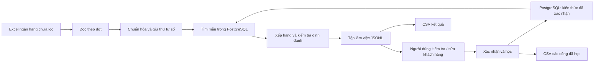
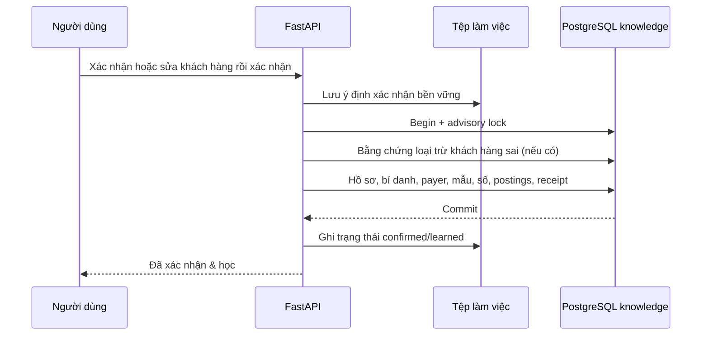

# Cơ chế tìm kiếm, so khớp và học kiến thức

Tài liệu mô tả implementation trong `app/normalize.py`, `app/numeric_match.py`, `app/core.py`, `app/knowledge.py`, `app/main.py` và `app/workspace.py`. Các tệp thử nghiệm theo tháng không quyết định cách vận hành của giao diện.

## 1. Hai luồng tách nhau



Phân loại gọi `Core.classify()` và không thêm kết quả dự đoán vào PostgreSQL. Mỗi đợt đối soát đọc knowledge trong transaction `REPEATABLE READ READ ONLY` trên PostgreSQL. Phần đã phân loại được ghi vào tệp làm việc ngoài database.

Luồng triển khai quét mọi sheet trong XLSX, nhận diện cột theo tiêu đề riêng từng sheet và giữ `sheet/payer/reference` trên kết quả/CSV. Import đọc các sheet đã có nhãn; CSV học đọc mọi dòng/kênh. Các trường ngày/số tiền/chiều giao dịch chưa đáng tin trả manual 0% trước khi gọi bộ so khớp. Sheet không phải bố cục giao dịch được liệt kê trong tác vụ, không bị giả lập thành giao dịch. Giới hạn BIDV của benchmark theo tháng chỉ thuộc công cụ phát triển.

Xác nhận gọi `Core.review()` rồi `Core.learn()` trong transaction ghi có advisory lock. Thay đổi chỉ xuất hiện trong kho kiến thức sau khi transaction commit. Xác nhận trong lúc đối soát có thể ảnh hưởng đến các đợt đọc kiến thức **sau đó**; các kết quả đã tạo không được thay đổi ngầm.

## 2. Chuẩn hóa vẫn bảo toàn số

Đầu vào được lưu nguyên văn ở `raw_example` đối với mẫu đã học hoặc `raw` trong tệp làm việc đối với dòng chưa duyệt.

Để tìm kiếm, hệ thống tạo thêm:

- `normalized`: chữ thường, bỏ dấu để đối chiếu từ ngữ; giá trị số vẫn là chuỗi.
- `segments`: các đoạn text/number/date theo thứ tự, với vị trí và offset gốc.
- `template`: nội dung chữ và placeholder `<NUM_1>`, `<NUM_2>`…; mã chữ/số giữ hình dạng chữ và vị trí số.
- `structure`: chuỗi vai trò/định dạng theo thứ tự.
- `semantic_text`: tiếng Việt giữ dấu; ngày và giá trị định danh được thay bằng vai trò trước khi đưa vào encoder.

Ví dụ:

```text
TT KH:001234 HD:700012 TIEN NUOC
```

```json
{
  "template": "tt kh <NUM_1> hd <NUM_2> tien nuoc",
  "numbers": [
    {"slot": 1, "numeric_type": "CUSTOMER_ID", "value": "001234"},
    {"slot": 2, "numeric_type": "CONTRACT_ID", "value": "700012"}
  ]
}
```

Giá trị số không được đổi sang float/int, không cắt chuỗi, không tự chia một chuỗi số dài thành các mã khách hàng. `raw_value` trong segments giữ cách ghi gốc. Các token chữ/số liền nhau được giữ nguyên; hợp đồng có dấu nối hoặc dấu `/` được bảo vệ khỏi việc tách sai.

### Vai trò của số

| Vai trò | Cách dùng |
| --- | --- |
| CUSTOMER_ID | Định danh khách hàng có ngữ cảnh rõ ràng. |
| CONTRACT_ID | HD/hợp đồng; phải đối chiếu hợp đồng chính xác. |
| CARD_ID / ACCOUNT_ID | Thẻ hoặc tài khoản người trả tiền; kiểm tra có dùng chung cho nhiều khách hàng không. |
| MIXED_CODE / LOCATION_NUMBER | Mã chữ/số, số cơ sở; khác giá trị ở đúng vai trò có thể chặn ghép. |
| INVOICE_ID / INVOICE_CODE | Thông tin hóa đơn; có thể thay đổi theo khoản thu, không tự xác lập khách hàng. |
| BANK_REFERENCE / BANK_PROTOCOL / REFERENCE_ID | Tham chiếu/giao thức thay đổi; không tự dùng làm định danh. |
| RECEIVER_ACCOUNT | Tài khoản nhận tiền của đơn vị cấp nước; không dùng làm tài khoản khách hàng trả tiền. |
| DATE / AMOUNT / QUANTITY | Không tự xác định khách hàng. |
| UNKNOWN_NUMBER | Chưa đủ ngữ cảnh; chỉ dùng làm chứng cứ khách hàng khi đã có xác nhận gắn đúng token/vị trí. |

`HD` luôn là **hợp đồng**, không phải hóa đơn. Chỉ ngữ cảnh `hóa đơn/invoice` mới là số hóa đơn. `TKThe` là thẻ của người trả tiền, không phải mã khách hàng.

Có một ngoại lệ rõ ràng ở **tra cứu hồ sơ mã khách hàng**: `id_key()` bỏ số 0 đầu để tìm các biến thể mã được xác nhận là cùng hồ sơ, ví dụ `001234` và `1234`. Cơ chế này không áp dụng cho hợp đồng, thẻ, tài khoản hoặc giá trị lưu trong numeric features. Giá trị đầy đủ và mẫu theo từng cách ghi vẫn được giữ và ưu tiên so khớp nguyên văn.

## 3. Một khách hàng, nhiều mẫu

Khóa mẫu mới là SHA-256 của:

```text
[template, structure, ordered_identity]
```

`ordered_identity` chứa `(slot, numeric_type, full_value, format)` của mã khách hàng, hợp đồng, mã chữ/số, số cơ sở và token số đã được xác nhận là thuộc khách hàng.

Do đó:

- Đổi nội dung chữ hoặc cấu trúc → có thể tạo mẫu mới.
- Cùng chữ nhưng khác hợp đồng/mã định danh quan trọng → mẫu riêng.
- Đổi ngày, tham chiếu ngân hàng hoặc số hóa đơn biến đổi → có thể cập nhật cùng mẫu.
- Một mẫu có nhiều giá trị theo từng slot, được lưu ở `numeric_features`; không phải mỗi lần xuất hiện đều tạo một mẫu mới.

Ràng buộc unique là `(customer_id, fingerprint)`, **không** phải unique trên `customer_id`.

Mẫu từ phiên bản cũ được tái sử dụng nếu template, structure và định danh của ví dụ đã lưu phù hợp. Không đổi fingerprint của mọi mẫu cũ hay rebuild embedding tự động. Các ví dụ khác đã bị gộp ở phiên bản cũ không thể được dựng lại chỉ từ một `raw_example`; cần thêm nội dung đã xác nhận tương ứng qua giao diện. Nhập lại cùng tệp đã được đánh dấu hoàn tất vẫn tuân theo chống trùng.

## 4. Retrieval: tìm ứng viên trước, không rerank toàn bộ kho

Mặc định tối đa 40 mẫu được rerank, cấu hình bằng `CANDIDATE_LIMIT`.

### Các đường ưu tiên

1. **Có mã khách hàng rõ ràng:** dùng posting `id:` để giới hạn mẫu của khách hàng đó. Ưu tiên mẫu có hợp đồng/mã cụ thể khớp, mã khách hàng nguyên văn khớp, template/structure phù hợp, rồi thời điểm cập nhật. Điều này giúp mẫu mới không bị bỏ qua chỉ vì khách hàng đã có nhiều mẫu cũ.
2. **Hợp đồng hoặc số đã gắn với khách hàng:** thử posting `contract:` và `bound-id:` trước.
3. **Người trả tiền/mã chữ-số/nội dung đặc trưng:** thử `payer:`, `code:` và `detail:`.
4. **Khi chưa có đường định danh đủ mạnh:** tìm theo từ, tên, tài khoản, số phù hợp và vector buckets; cộng thêm các truy vấn PostgreSQL bên dưới rồi hợp nhất ứng viên.

Các đường có định danh cụ thể có thể trả ứng viên sớm; không phải mọi truy vấn đều chạy tất cả phương thức search.

### Các chỉ mục PostgreSQL

- Khóa tra cứu có digest SHA-256, đồng thời so lại toàn bộ token để bảo đảm giá trị chính xác.
- Full-text: `to_tsvector('simple', template_text)` và `plainto_tsquery`, xếp hạng `ts_rank_cd`.
- Trigram: `%`/`similarity()` trên template và tên khách hàng.
- Vector: pgvector HNSW, khoảng cách cosine `embedding <=> query_vector`.

Đây là hybrid retrieval gồm exact/structured + full-text + trigram + vector; không có LLM sinh nội dung để quyết định mã khách hàng.

## 5. Embedding tiếng Việt

Encoder hiện tại là `intfloat/multilingual-e5-small`, 384 chiều, chạy CPU theo cấu hình mặc định. Không dùng Ollama hoặc mô hình sinh văn bản cục bộ.

Nội dung đưa vào encoder giữ dấu tiếng Việt, thay số định danh bằng vai trò và bỏ ngày. Hai phía dùng prefix `query:` cho so sánh đối xứng. Vector được chuẩn hóa và cache theo mô hình/nội dung. Tham khảo [model card chính thức](https://huggingface.co/intfloat/multilingual-e5-small).

Cosine cao chỉ hỗ trợ tìm/xếp hạng nội dung. Nó không chứng minh một hợp đồng hoặc khách hàng là đúng và không vượt qua mâu thuẫn định danh.

## 6. Reranking theo từng mẫu

| Feature | Trọng số |
| --- | ---: |
| Khách hàng: ID/tên/hợp đồng/token đã xác nhận | 0.30 |
| Người/kênh trả tiền | 0.10 |
| Nội dung | 0.20 |
| Cấu trúc và thứ tự | 0.15 |
| Số khớp chính xác | 0.15 |
| Bằng chứng lịch sử | 0.10 |

```text
text = 0.65 × lexical_template_similarity + 0.35 × vector_cosine
weighted_score = Σ weight(feature) × feature_value
history = 0.5 × pattern_confidence
        + 0.5 × min(1, log(1 + seen_count) / log(10))
```

Điểm số là giá trị lớn nhất của đóng góp exact-value hợp lệ và mức đồng thuận số ổn định theo thứ tự. Exact-value chỉ góp khi trùng vai trò, giá trị đầy đủ, định dạng, vị trí đã đối chiếu và template tương thích. Tham chiếu/giao thức/tài khoản nhận/số chưa xác định không tự được dùng làm bằng chứng định danh dương.

Bên cạnh điểm trọng số, có các điều kiện bằng chứng mạnh để nâng điểm: ID đã biết + nội dung phù hợp/mục đích tiền nước; hợp đồng duy nhất + đúng mẫu; token khách hàng đã được xác nhận; mã chữ/số duy nhất với toàn bộ định danh đúng thứ tự; tài khoản trả tiền duy nhất kèm nội dung/địa điểm phù hợp; hoặc tên đã xác nhận và nội dung đặc trưng thuộc duy nhất một khách hàng.

Các điều kiện nâng điểm vẫn chịu kiểm tra mâu thuẫn và loại trừ ở bước tiếp theo.

## 7. Ưu tiên precision và kiểm tra số theo thứ tự

Mẫu và giao dịch được so bằng sequence vai trò/định dạng, không dùng một tập số bỏ thứ tự.

- Nếu sequence ổn định trùng và template phù hợp, các tham chiếu biến đổi có thể được thêm/bớt mà vẫn đối chiếu định danh theo đúng vai trò. Giao diện hiển thị cả slot hiện tại và slot lịch sử khi chúng khác nhau.
- Mã hợp đồng khác nhau chặn ghép tự động.
- Mã chữ/số hoặc số cơ sở khác giá trị ở vai trò tương ứng chặn ghép.
- Token số trần đã được gắn với khách hàng còn phải trùng vị trí tuyệt đối, vai trò, định dạng và giá trị đầy đủ.
- Tài khoản/thẻ dùng chung không đủ để xác lập khách hàng.
- Tên tổ chức chung hoặc template chuyển tiền phổ biến không đủ để xác định đồng hồ.
- Một giao dịch có nhiều mã khách hàng cần phân bổ thủ công; không tự chọn một mã trong danh sách.
- ID rõ ràng nhưng không có trong knowledge → khách hàng rỗng, điểm 0%, kiểm tra thủ công.
- Không có bằng chứng khách hàng đáng tin → điểm 0%, kiểm tra thủ công; có thể hiển thị mẫu gần nhất để người dùng tham khảo.
- Hard negative áp dụng cho cặp nội dung chuẩn hóa/khách hàng đã bị từ chối; ứng viên đó bị hạ về 0.

Sau khi chấm các mẫu, hệ thống giữ **mẫu tốt nhất của mỗi khách hàng**. Các mẫu của cùng khách hàng không tạo một cuộc cạnh tranh giả. Nếu hai khách hàng có điểm đủ cao và chênh dưới 0.04, kết quả được hạ xuống vùng cần duyệt.

Mặc định `AUTO_THRESHOLD=0.90`, `REVIEW_THRESHOLD=0.60`. Các guard có thể hạ điểm dưới vùng duyệt hoặc chuyển về manual 0%, nên không chỉ kiểm tra một ngưỡng tổng.

## 8. Xác nhận, sửa manual và học ngay



`Core.review()` dùng `Core.learn()` ngay. Nó không đợi nút cập nhật hoặc một đợt import khác. Người dùng phải bấm xác nhận; thay đổi nội dung ô hoặc chọn checkbox để đưa vào danh sách không tự học.

Nếu sửa A thành B, negative cho A và positive cho B nằm trong cùng transaction. Bí danh do người dùng xác nhận cũng được cập nhật vào khóa tìm kiếm. Khi chỉ từ chối, không tạo mẫu dương.

Nếu PostgreSQL commit xong nhưng ghi trạng thái file bị gián đoạn, ý định còn trong `intents/`. Khi khởi động lại hoặc bấm tiếp tục, hệ thống lặp lại cùng nội dung với cùng receipt. Positive receipt chống học hai lần; negative receipt theo hành động cũng chống ghi loại trừ hai lần.

### Chống trùng

- Excel xác nhận: receipt từ nội dung, khách hàng, ngày, số tiền và dòng nguồn; file import hoàn tất còn được nhận diện bằng SHA-256 toàn bộ file.
- Xác nhận trên web / CSV đã học / thêm mẫu trực tiếp: receipt từ nội dung gốc, mã khách hàng chính thức, ngày, số tiền và kênh trả tiền.
- Hai dòng hoàn toàn trùng các trường trên được xử lý bảo thủ như cùng bằng chứng học. Số lần gặp không tăng giả vì import/export lại.
- Receipt chỉ lưu hash, khách hàng và kỳ; không lưu toàn bộ lịch sử kết quả lọc.

### Confidence theo kỳ

Mẫu, payer, slot và giá trị số mới bắt đầu ở 0.20. Xuất hiện ở kỳ mới hợp lệ: `c_new = c + 0.30 × (1 - c)`. Giá trị vắng mặt ở kỳ mới của cùng mẫu: `c_new = c × 0.7`. Giá trị dưới 0.05 không tham gia phần exact-value đang dùng. Nhiều bản sao trong cùng kỳ không tạo thêm độ tin cậy theo kỳ. Ngày không xác định không được dùng để giả lập tái xuất hiện qua tháng.

## 9. Giới hạn thực tế

- Chưa có bộ reranker học máy hoặc xác suất được hiệu chuẩn; hiện tại là weighted/rule reranking.
- Retrieval bị giới hạn số mẫu; có thể bỏ sót khi một hồ sơ có rất nhiều biến thể. Giới hạn có thể cấu hình, nhưng không nên nới tự động mà bỏ kiểm tra số.
- Kết quả trong tệp làm việc là snapshot của lần đối soát, không tự đổi theo knowledge mới. Muốn tính lại thì tạo một tác vụ đối soát mới.
- Không có số F1 mới cho phiên bản quản trị này: không chạy lại benchmark theo yêu cầu người dùng. Báo cáo cũ trong `reports/` thuộc phiên bản đã đo trước đó.
- Tác vụ và tệp làm việc cần chạy trong một process Uvicorn. Không sử dụng nhiều worker cùng ghi một thư mục working.
