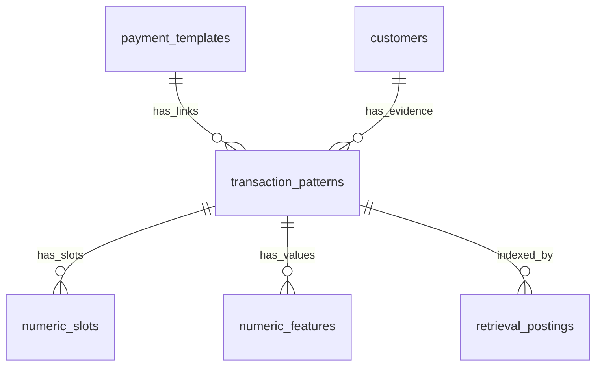

# Mẫu chung, liên kết khách hàng và dịch vụ thu hộ

Schema tách **bố cục dùng chung** khỏi **bằng chứng thuộc từng khách hàng**. Nội dung do dịch vụ ngân hàng/ví tạo có thể giống nhau cho hàng nghìn khách hàng; khớp bố cục này chưa xác định người cần ghi nhận thanh toán.



## Các bảng và quan hệ

| Bảng | Trách nhiệm |
| --- | --- |
| `payment_templates` | Bố cục chung: `template_text`, `structure`, fingerprint, tên quản lý, ghi chú, loại thanh toán mặc định đã được admin xác nhận, đơn vị thu hộ và ngày tạo. Không lưu các mã khách hàng/hợp đồng như giá trị chung. |
| `transaction_patterns` | Liên kết/bằng chứng giữa `customer_id` và `template_id`: ví dụ nguyên văn, mẫu riêng còn các chi tiết cá nhân, vector, nguồn, độ tin cậy và số lần gặp. |
| `numeric_slots` | Thống kê slot của **liên kết khách hàng**, qua `pattern_id`. |
| `numeric_features` | Các giá trị đầy đủ theo slot/vai trò của **liên kết khách hàng**, qua `pattern_id`. |

Một mẫu chung có nhiều khách hàng; một khách hàng có nhiều mẫu chung. Nếu một khách hàng dùng cùng bố cục với nhiều hợp đồng hoặc mã quan trọng, có thể có nhiều bản ghi liên kết, mỗi bản ghi giữ bộ định danh riêng. Unique `(customer_id, fingerprint)` của liên kết được giữ để tránh gộp số quan trọng. Không chuyển numeric features sang trỏ trực tiếp tới mẫu chung, vì như vậy giá trị của khách hàng A có thể bị dùng cho B.

`transaction_patterns.template_text` tiếp tục là biểu diễn riêng của ví dụ thuộc khách hàng, dùng cho đối chiếu chi tiết; `payment_templates.template_text` là bố cục chung để quản lý/tìm ứng viên. Embedding cũng giữ ở liên kết, bảo toàn những chi tiết giúp phân biệt khách hàng. Việc tách bảng không yêu cầu dựng lại vector của kho.

Mẫu chung giữ nguyên các placeholder số theo thứ tự và cấu trúc vai trò. Tên hợp lệ từ NER hoặc tên khách hàng đã xác nhận có thể được thay bằng `<NAME>` **chỉ trong bố cục chung**. Không sửa nội dung gốc, không đổi số thành tên, không cắt số 0 đầu. Khóa mẫu chung là SHA-256 của `shared_shape + chr(31) + structure`; kiểm tra lại đầy đủ nội dung/cấu trúc sau khi tra hash. Chỉ gộp bố cục chung chính xác; không tự gộp các mẫu gần giống 90% làm mất khác biệt định danh.

## Proxy và self

Kiểu thanh toán lưu trên **mẫu chung** để quản trị viên gán mặc định, đồng thời lưu trên **từng liên kết** để hỗ trợ ngoại lệ. Cùng bố cục có thể được dùng theo nhiều cách:

- `proxy`: thu hộ qua dịch vụ ngân hàng, ví điện tử hoặc bên khác.
- `self`: khách hàng tự chuyển tiền.
- `unknown`: chưa có căn cứ; không tự coi là self.

`provider_kind` là `bank`, `wallet`, `other` hoặc `unknown`; `provider_name` là tên đơn vị thu hộ. Các trường này mô tả bên trung gian, không phải ID khách hàng. Với self, thông tin đơn vị thu hộ được để trống. Ngân hàng/kênh nhận biết từ sheet vẫn lưu ở payer riêng; tên sheet BIDV/MB không chứng minh giao dịch là thu hộ.

Không suy thu hộ chỉ từ tên sheet, tài khoản ngân hàng hoặc số khách hàng dùng mẫu. Protocol BIDV O@L chỉ tạo gợi ý thu hộ, không tự gán nhãn proxy. Loại thực tế lấy từ nhãn nguồn đã kiểm tra, admin gán trên mẫu/liên kết, hoặc liên kết lịch sử đã xác nhận khi giao dịch khớp chính xác bố cục chung và có bằng chứng số riêng đủ mạnh để được chấp nhận. Thiếu căn cứ giữ unknown. NER chỉ trích tên, không quyết định thu hộ/tự trả. Có thể cung cấp ba cột tùy chọn `KIEUTHANHTOAN`, `LOAIDONVITHUHO`, `DONVITHUHO` khi học/đối soát. Giá trị lần lượt là các mã liệt kê ở trên và tên đơn vị; không dùng tên người trả tiền thay IDKH.

## So khớp để tránh chọn nhầm khách hàng

1. Đối chiếu ID/hợp đồng/mã đã xác nhận trên toàn kho; mâu thuẫn hoặc ID chưa biết vẫn trả thủ công 0%.
2. Đường `shared_template` tìm bố cục chung qua posting `template:<hash>`, trọng số RRF 2. Đây là đường tìm ứng viên, không phải bằng chứng chấp nhận.
3. Rerank **liên kết khách hàng**, dùng ví dụ, số đầy đủ, vai trò/định dạng và thứ tự của chính liên kết đó.
4. Đếm khách hàng của mẫu chung trên toàn kho bằng `template_id`, không giới hạn trong tập ứng viên.
5. Nếu nội dung có gợi ý thu hộ, giao dịch/liên kết là proxy, mẫu có nhiều khách hàng, hoặc cả hai phía còn unknown, phải có bằng chứng số riêng đủ tin cậy: ID rõ ràng khớp hồ sơ, hợp đồng duy nhất đã khớp, token khách hàng đã xác nhận đúng vị trí, hoặc mã chữ/số duy nhất đã đối chiếu. Những kiểm tra thiếu/đổi/chệch thứ tự vẫn có thể chặn chấp nhận.
6. Không đủ bằng chứng này thì trả kiểm tra thủ công 0%, dù tên, tài khoản trung gian hoặc bố cục rất giống. Self vẫn chịu kiểm tra định danh/tài khoản dùng chung, tên trùng và khách hàng cạnh tranh.

Do đó dữ liệu ban đầu chỉ có một khách hàng trong dịch vụ thu hộ cũng không làm tài khoản ngân hàng trung gian thành định danh riêng của khách hàng đó. Với dữ liệu self cũ chưa có loại, có thể xác nhận self trong quản lý liên kết khi đã kiểm tra; không tự suy self để nâng điểm.

Evidence trả `shared_template_id`, `shared_template`, `shared_template_customer_count`, `matched_payment_mode`, thông tin đơn vị và `numeric_customer_evidence`, bên cạnh các đối chiếu số hiện có. UI kiểm tra cho thấy mẫu chung/số khách hàng dùng mẫu. Kết quả cũ giữ đề xuất cũ; sửa kiến thức áp dụng cho các lần đối soát tiếp theo.

## Quản lý trên web

Trong **Quản lý kiến thức**:

1. Chọn **Mẫu dùng chung** để tìm mẫu, xem bố cục, số khách hàng/liên kết, đặt tên quản lý hoặc ghi chú.
2. Chọn **Xem khách hàng dùng mẫu** để mở danh sách liên kết có phân trang.
3. Trong một liên kết, xem/sửa ví dụ riêng, đối chiếu số riêng hoặc **Lưu kiểu thanh toán** chỉ cho liên kết đó.
4. Ở mẫu chung, phần **Đánh dấu thu hộ / tự trả cho mẫu** mở sẵn. Chọn **Thu hộ qua ngân hàng / ví**, **Khách hàng tự trả** hoặc **Chưa xác định**; điền loại và tên đơn vị thu hộ nếu có. Đánh dấu xác nhận phạm vi rồi bấm **Lưu loại của mẫu & áp dụng**. Backend lưu loại mặc định trên mẫu chung và cập nhật toàn bộ liên kết hiện có trong cùng transaction. Khi học liên kết mới cùng mẫu, nếu nguồn không cung cấp nhãn riêng thì dùng mặc định này. Thao tác không trộn số hoặc tăng lần học.
5. Với ngoại lệ, mở liên kết và **Lưu kiểu thanh toán**: chỉ liên kết này đổi, không đổi loại mặc định của mẫu hay liên kết khác. Nhãn riêng trong tệp hoặc UI được ưu tiên; chọn unknown rõ ràng cũng được giữ. Gán lại loại toàn mẫu sẽ thay cả các ngoại lệ hiện có, nên cần kiểm tra checkbox phạm vi.
6. Xóa liên kết chỉ xóa số/posting riêng của liên kết đó. Mẫu chung và các khách hàng khác được giữ. Chỉ được xóa mẫu chung khi không còn liên kết.

Khi **Xác nhận & học**, UI cho chọn kiểu thanh toán và đơn vị thu hộ. Thông tin được ghi cùng xác nhận và có trong các tệp xuất. CSV học giữ 9 cột cũ và thêm 3 cột tùy chọn về kiểu/đơn vị; CSV cũ thiếu những cột này vẫn đọc được. Receipt không phụ thuộc nhãn proxy/self để tránh tăng lần học khi chỉ chỉnh loại. Lựa chọn **Theo mẫu đã xác nhận (nếu có)** không đoán từ nội dung; dùng nhãn đã lưu hoặc giữ unknown nếu chưa có. Kết quả duyệt và CSV ghi loại thực tế đã lưu trên liên kết.

## SQL từ đầu và nâng cấp

Với database trống, chạy **chỉ `sql/create_current.sql`**. File đã có 11 bảng, FK, unique/check constraints, chỉ mục truy xuất và quyền cho `invoice_app` nếu tài khoản tồn tại. Không chạy init hoặc migration trước/sau file này. File không tạo database/login và không xóa dữ liệu hiện có.

Windows PowerShell:

```powershell
psql -U postgres -h 127.0.0.1 -p 5432 -d invoice_filter -v ON_ERROR_STOP=1 -f "sql/create_current.sql"
```

Linux có thể dùng cùng lệnh TCP trên, hoặc chạy từ tài khoản người dùng có quyền đọc file:

```bash
sudo -u postgres psql -d invoice_filter -v ON_ERROR_STOP=1 < sql/create_current.sql
```

Với database phiên bản knowledge-only đã có dữ liệu, dừng ứng dụng, sao lưu rồi tự chạy `sql/migrations/003_shared_templates.sql`. Migration nhóm bố cục hiện có chính xác, gắn các liên kết tới mẫu chung và giữ nguyên IDs, numeric features, slots, receipts, vector và số lần gặp. Tài khoản ứng dụng được cấp quyền bảng/sequence mới nếu dùng login `invoice_app`. Script dùng [SHA-256 tích hợp của PostgreSQL](https://www.postgresql.org/docs/16/functions-binarystring.html).

Backfill SQL giữ biểu diễn tên cũ; không chạy NER trong database. Có thể nhập lại tệp đã xác nhận sau nâng cấp để bổ sung alias và gắn liên kết sang bố cục có `<NAME>` khi trích được. Receipt ngăn tăng lại thống kê mẫu/số. Các mẫu/liên kết cũ mặc định unknown; script không tự gán thu hộ bằng dấu hiệu protocol. Không tự áp dụng migration từ backend.

Cài dependency cập nhật rồi khởi động lại dịch vụ. Chỉ kiểm tra cú pháp/DDL sinh trên mock engine cho thay đổi này; chưa chạy model, backend, PostgreSQL hay benchmark theo yêu cầu của người dùng. Chưa có số liệu precision/F1 mới; các điều kiện chặn được thiết kế ưu tiên hạn chế ghép nhầm, có thể tăng số dòng cần duyệt.
